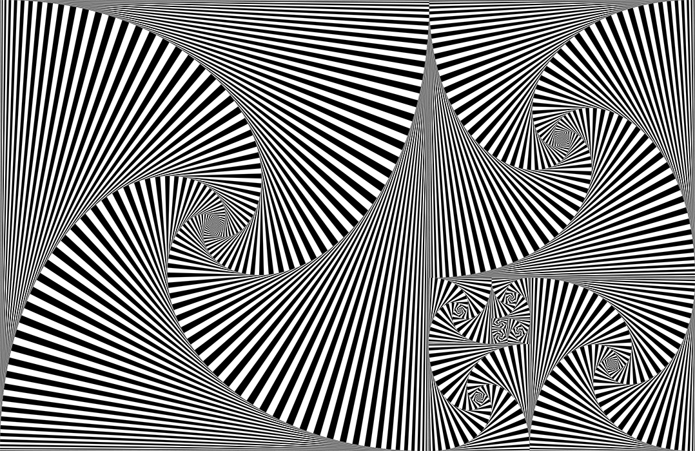
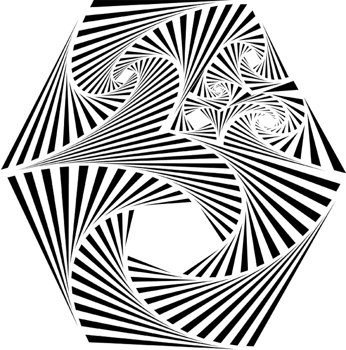
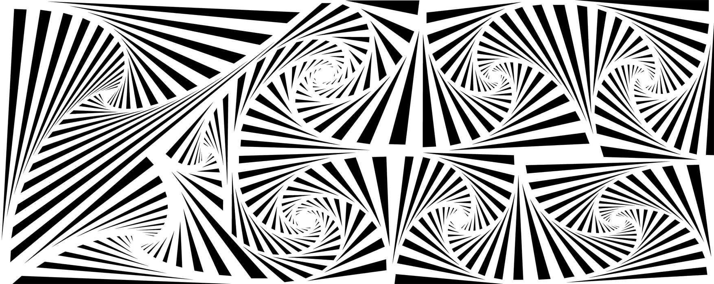

# Vector Recursion Workbench
This is a tool for laying out recursively nested polygons that can be exported as an SVG.  
*Designed with laser cutting in mind.*
<br>


<br><br>

## App Screenshots

*Screenshot: previewing the guide lines*


*Screenshot: previewing the guide lines and recursion concurrently*
<br><br>

### Standalone App
To play with this software without any fuss, check out the [standalone app](https://github.com/nuclearsugar/VectorRecursionWorkbench/releases) available for Mac & Windows.

### Development Frozen
This software is no longer being maintained and issues will not be fixed. But you're welcome to fork this project.

### Dependencies
Python 2.7.9  
wxPython 3.0.1.1  
PyOpenGL 3.1.0  

### Usage
Run this script in a CMD shell to initiate the GUI:  
```python VRW-gui.py```
<br><br>

## Documentation
### Preview Window
- **Draw Guide Line**: Allows you to draw a guide line onto the canvas. (hotkey is ‘d’.) To cancel drawing a guide line hit ‘ESC’. If you need to slice a specific shape, then first click to select that shape and then draw the guide line within it.  
- **Delete Guide Lines**: Allows you to delete a specific guide line by clicking on it. (hotkey is ‘x’.) Useful mainly for creating shapes such as a pentagon. *Beware: deleting a line is risky and may break your layout, so be sure to save prior.*  
- Undo (cmd-z) and Redo (cmd-shft-z) are functional for guide lines. *Beware: But if you try to undo the change of a shape attribute, then all of the attributes will revert to their original state (known annoying bug). Also undo-ing a guide line is risky and may break your layout, so be sure to save often.*  
- **Snapping**: When drawing a guide line, the cursor will snap to the nearest corner when within a certain proximity.  
- **Hide Guide Lines**: Makes the guide lines invisible within the preview area so that you can see the recursion as it will be exported.  
- **Hide Shape #’s**: Makes the shape #’s invisible within the preview area. But you can still select a shape.  
- **Preview**: Allows you to preview just the guide lines, or preview the guide lines and recursion concurrently.  
- **Aspect Ratio**: Allows you to fit the recursion to the canvas, or stretch the recursion to the canvas. When exporting, fit will always be used. But stretch is useful if you’re doing projection mapping and want to layout in context.

### Shape Attributes
- Select a shape by click on the # within the preview window.  
- **Direction**: Decide whether the recursion iterates clockwise or counter-clockwise.  
- **Depth**: Limits the amount of iterations.  
- **Step**: Increases or decreases the spacing of the shape recursion.  
- **Inner**: Increases or decreases the spacing of the shape recursion, but affecting the inner iterations more heavily. This allows you to decide on the complexity of the inner iterations without affecting the outer iterations.  
- **Reverse Colors**: Swap the starting color. This is important for maintaining a cohesive pattern when laying out a piece.  
- **Disable**: This will turn off recursions for the currently selected shape and it will not render when exported. This is useful for creating unique canvas shapes, such as a hexagon. It’s also useful for creating empty spaces within your layout. Or approaching it creatively to create a silhouette within your layout.  
- **Footer**: Adds extra spacing around each triangle. Affects the overall recursion evenly.  
- **Buffer**: Adds extra spacing around each triangle. Affects the inner iterations more heavily.  
- **Offset**: Adjusts the starting point of which the Buffer begins within the outer iterations.

### Global Attributes
- **Step**: Increases or decreases the spacing of the shape recursion for the whole layout. Every shape is affected equally, without resetting the individual Shape Step setting.  
- **Colors**: Determine what two colors are used to alternate within the recursion.  
- **Canvas Width/Height**: Set in pixels of your monitor. Just a way to determine the aspect ratio since the SVG exports are vector in nature.  
- **Load Background Image**: Allows you to load a background image within the preview window. This background image does not affect the recursion or export, it can only be used as a helper when laying out guide lines. It can be useful for tracing complex patterns you want to draw. To see an example, check of the ‘FaceSilhouette_001’ or ‘Hands_001’ within the Examples folder.

### Saving & Exporting
- **File > Save as**: Writes an JSON file which can be opened later and edited.  
- **File > Export**: Writes an SVG of the whole canvas. This is the easiest approach for when you’re doing a single laser cut piece.  
- **File > Export Shapes**: Exports in a modular fashion by writing multiple SVG’s. One SVG is exported for each shape # on the canvas. This option is useful if you want to cut out each shape # individually and then physically assemble them all together after completed. So long as you plan with the max dimensions of your work bed in mind, then you can fill a wall of unlimited size.

### Post-Production
- If you need to alter the exported SVG or combine multiple SVG’s, [Inkscape](https://inkscape.org/) is free and highly recommended.
<br><br>

## History
This software was programmed by [Nathan Williams](https://github.com/nathanlws) and designed by [Jason Fletcher](http://www.jasonfletcher.info/).

I was first introduced to this technique through drawing by hand. Over the years I experimented with different approaches and started using an exacto blade to cutout the patterns into paper. I loved the resulting artworks but the effort required was enormous and difficult on my hands. So for many years I dreamed of creating a software which would automate the process and make laser cutting possible. While studying in college, Alex Horn helped me to create an early version of the idea first in Pure Data and then Adobe Flash. Then many years later I met Nathan and randomly shared my idea over a beer and a collaboration bloomed. This software is the result. Check out the Archive folder to see some early hand drawings of this software and its evolution.

I've long wanted to laser cut these patterns into wood and make giant latticed windows or pieces which precisely fill up an entire wall. Due to available free time, workspace constraints, and spare money, I haven't yet explored this dream. Someday I will but in the meantime why not open-source it? I would love to see your creations, please share photos with me. Cheers!


*Red paper which have been hand cut to create a lattice art piece - (9x2ft / 274x60cm)*


*A similar recursion pattern can been mimicked using this software*


*Then by tweaking the shape Footer, Buffer, & Offset attributes, the piece can be optimized for laser cutting*
<br><br>

## License
The MIT License (MIT)  
Copyright (c) 2014-2016 Nathan Williams, Jason Fletcher  
It is free software and may be redistributed under the terms specified in the LICENSE file.
<br><br>

## Example Renders (rasterized)
*SVG versions of these renders are available within the Examples folder.*











